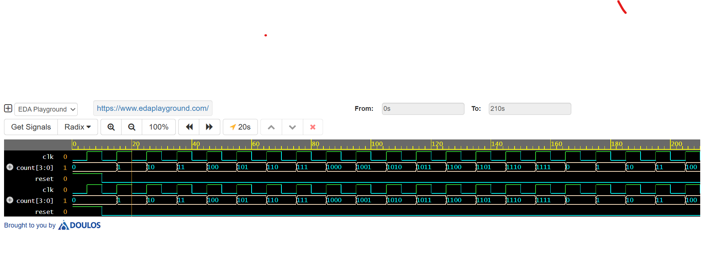

# 4-Bit Synchronous Counter

### 📌 Project Overview
A synthesizable 4-bit up-counter designed in Verilog HDL. This project demonstrates the fundamentals of sequential logic design, active-high reset implementation, and clock-edge triggering.

### 🛠 Technical Details
* **Language:** Verilog (IEEE 1364-2005)
* **Simulator:** Icarus Verilog 0.9.7
* **Waveform Viewer:** EPWave

### 📉 Verification Results
The design was verified using a self-checking testbench.
* **Observation:** The counter increments (0 -> 1 -> 2...) only on the rising edge of the clock.
* **Reset Check:** When Reset=1, the output holds at 0000.

